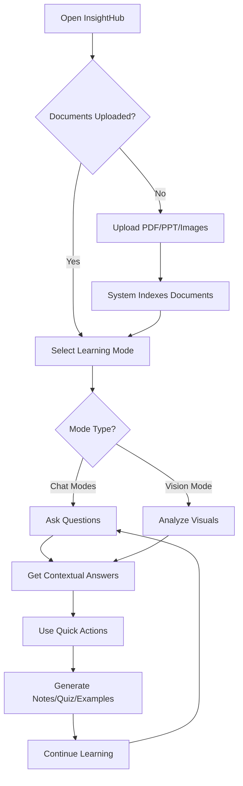

<div align="center">

# 🧠 InsightHub-AI

### *Your Intelligent Knowledge-First Educational Companion*

[](https://reactjs.org/)
[](https://fastapi.tiangolo.com/)
[](https://www.typescriptlang.org/)
[](https://www.python.org/)

**[Features](#-core-features)** • **[Demo](#-live-demo)** • **[Quick Start](#-quick-start)** • **[Architecture](#-system-architecture)** • **[Documentation](#-documentation)**

---
  
</div>

## 📖 Table of Contents

- [Overview](#-overview)
- [The Problem](#-the-problem)
- [Our Solution](#-our-solution)
- [Core Features](#-core-features)
- [System Architecture](#-system-architecture)
- [Technology Stack](#-technology-stack)
- [Quick Start](#-quick-start)
- [User Workflow](#-user-workflow)
- [Learning Modes](#-learning-modes)
- [Practical Use Cases](#-practical-use-cases)
- [Design Philosophy](#-design-philosophy)
- [Roadmap](#-roadmap)
- [Contributing](#-contributing)

---

## 🎯 Overview

**InsightHub-AI** is an intelligent educational platform that transforms how students, educators, and self-learners interact with their learning materials. Built on **Retrieval-Augmented Generation (RAG)** technology, InsightHub provides accurate, context-aware answers directly from your uploaded documents—no hallucinations, just facts.

### ✨ What Makes InsightHub Special?

- 🎯 **100% Document-Grounded**: Every answer is sourced from your materials
- 👁️ **Vision AI**: Understands diagrams, tables, charts, and visual content
- 🎓 **6 Learning Modes**: Adapts to your learning style (Student, Teacher, Exam, Revision, Practical, Vision)
- 💬 **Natural Conversations**: Ask follow-up questions like talking to a tutor
- 📊 **Smart Document Navigation**: Preview PDFs and images in-app
- 🌓 **Beautiful UI**: Modern dark/light themes with smooth animations

---

## 🔴 The Problem

**Problem Statement (PS-12): Knowledge Discovery in Educational Documents**

Students and professionals spend **hours** searching through PDFs, presentations, and documents to find specific information. Traditional methods are:

- ⏱️ **Time-consuming**: Manual search through hundreds of pages
- 😤 **Frustrating**: Context switching between multiple documents
- ❌ **Inefficient**: No way to ask natural language questions
- 🤔 **Limited**: Cannot explain diagrams or visual content

**Example Scenario:**
> *"Where is the AWS spending limit mentioned in our project documentation?"*  
> Traditional approach: Open 10+ PDFs, Ctrl+F each one, cross-reference sections...  
> **InsightHub approach: Ask once, get instant answer with page reference.**

---

## ✅ Our Solution

InsightHub acts as your **intelligent study companion** that:

1. **📥 Ingests** your documents (PDF, PPT, DOCX, images)
2. **🧮 Processes** content into searchable embeddings via vector database
3. **🔍 Retrieves** relevant context using RAG
4. **🤖 Generates** accurate answers with source citations
5. **👁️ Explains** visual content (diagrams, charts, tables)
6. **💬 Maintains** conversation context for natural follow-ups

### Key Differentiators

| Feature | Traditional Chatbots | InsightHub-AI |
|---------|---------------------|---------------|
| **Knowledge Source** | Generic internet data | Your specific documents |
| **Accuracy** | Prone to hallucinations | 100% grounded in your content |
| **Source Citations** | None | Document name + page number |
| **Visual Understanding** | Text only | Analyzes diagrams & visuals |
| **Learning Modes** | One-size-fits-all | 6 adaptive modes |
| **Conversation Context** | Limited | Full context retention |

---

## 🚀 Core Features

### 1. 📚 **Document Intelligence (RAG System)**

<details>
<summary><b>How it works</b></summary>


- **Supported Formats**: PDF, PPTX, DOCX, JPG, PNG
- **Smart Chunking**: Preserves context and structure
- **Vector Search**: Fast semantic similarity matching
- **Metadata Tracking**: Document name, page numbers, sections

</details>

### 2. 👁️ **Vision Tutor Mode**

Explain visual content with AI-powered image understanding:

- 📊 **Diagram Analysis**: Understand flowcharts, architectures, processes
- 📈 **Chart Interpretation**: Read graphs, plots, statistical visualizations
- 🧪 **Formula Explanation**: Break down complex equations
- 🗺️ **Screenshot Understanding**: Analyze any on-screen content

**Workflow:**
1. Select Vision Tutor Mode
2. Choose/upload document with diagrams
3. Ask: *"Explain this diagram"* or *"What does this chart show?"*
4. Get detailed, contextual explanation

### 3. 🎓 **6 Adaptive Learning Modes**

Each mode tailors responses to your learning objective:

| Mode | Icon | Purpose | Output Style |
|------|------|---------|--------------|
| **Student** | 🎓 | Step-by-step learning | Detailed explanations with examples |
| **Teacher** | 📖 | Lesson planning | Structured content with teaching points |
| **Exam** | ❓ | Test preparation | Practice questions + exam tips |
| **Revision** | 🔁 | Quick review | Concise summaries + key points |
| **Practical** | 🔧 | Hands-on learning | Exercises + real-world applications |
| **Vision** | 👁️ | Visual understanding | Diagram explanations + visual context |

### 4. 💬 **Conversational Chat Interface**

- **Natural Language**: Ask questions like talking to a tutor
- **Follow-up Support**: Build on previous answers
- **Quick Actions**: 
  - 🔄 Explain again (simpler)
  - 💡 Give example
  - 📝 Generate notes
  - ❓ Create quiz

### 5. 📄 **In-App Document Viewer**

- **PDF Rendering**: View PDFs with page navigation
- **Image Preview**: Display JPG/PNG documents
- **Zoom Controls**: 50% - 200% zoom
- **Fullscreen Mode**: Distraction-free viewing
- **Synchronized Context**: Questions reference visible content

### 6. 🎨 **Modern UI/UX**

- **Dark/Light Themes**: Comfortable viewing in any environment
- **Smooth Animations**: Framer Motion powered interactions
- **Responsive Design**: Works on desktop, tablet, mobile
- **Glassmorphism**: Modern, premium aesthetic
- **IBM Plex Sans**: Professional typography

### 7. 🛡️ **Hallucination Prevention**

If your question isn't covered in uploaded documents:
> ❌ **"I cannot find information about [topic] in the uploaded materials."**

No made-up answers. Ever.

---

## 🏗️ System Architecture

### High-Level Architecture

```
┌─────────────────────────────────────────────────────────────┐
│                        FRONTEND                             │
│  ┌──────────────┐   ┌──────────────┐  ┌───────────────┐     │
│  │   Document   │   │   Chat UI    │  │  Learning     │     │
│  │   Upload     │   │  (React MD)  │  │  Modes        │     │
│  └──────┬───────┘   └──────┬───────┘  └───────┬───────┘     │
│         │                  │                   │            │
│         └──────────────────┴───────────────────┘            │
│                            │                                │
│                  React + Vite + Zustand                     │
└────────────────────────────┬────────────────────────────────┘
                             │ HTTP/REST API
┌────────────────────────────┴────────────────────────────────┐
│                        BACKEND                              │
│  ┌──────────────┐  ┌──────────────┐  ┌───────────────┐      │
│  │   Vision     │  │   Learning   │  │   Session     │      │
│  │   Tutor      │  │   Modes      │  │   Manager     │      │
│  └──────┬───────┘  └──────┬───────┘  └───────┬───────┘      │
│         │                  │                   │            │
│         └──────────────────┴───────────────────┘            │
│                            │                                │
│                    FastAPI + Python                         │
└────────────────────────────┬────────────────────────────────┘
                             │
┌────────────────────────────┴────────────────────────────────┐
│                     AI/ML LAYER                             │
│  ┌──────────────┐  ┌──────────────┐  ┌───────────────┐      │
│  │    Qwen      │  │   Document   │  │   Vector      │      │
│  │   2.5 VL     │  │   Processor  │  │   Embeddings  │      │
│  └──────────────┘  └──────────────┘  └───────────────┘      │
│                                                             │
│           RAG + Vision AI + Context Selection               │
└─────────────────────────────────────────────────────────────┘
```

### Data Flow

1. **Document Upload** → Document extraction → Chunking → Embedding generation → Vector storage
2. **User Query** → Session retrieval → Vector search → Context ranking → LLM generation → Response
3. **Vision Mode** → Screenshot capture → Image + text to Gemini Vision → Contextual explanation

---

## 🛠️ Technology Stack

### Frontend

| Technology | Purpose | Version |
|------------|---------|---------|
| **React** | UI Framework | 18.3.1 |
| **Vite** | Build Tool | 7.3.0 |
| **TypeScript** | Type Safety | 5.8.3 |
| **TailwindCSS** | Styling | 3.4.17 |
| **Framer Motion** | Animations | 12.23.26 |
| **Zustand** | State Management | 5.0.9 |
| **React Markdown** | Markdown Rendering | 10.1.0 |
| **React PDF** | PDF Viewer | 10.2.0 |
| **Shadcn/ui** | Component Library | Latest |
| **Lucide React** | Icons | 0.462.0 |
| **html2canvas** | Screenshots | 1.4.1 |

### Backend

| Technology | Purpose | Version |
|------------|---------|---------|
| **FastAPI** | Web Framework | Latest |
| **Python** | Core Language | 3.11+ |
| **Qwen 2.5 VL** | LLM (Text + Vision) | 2.0 Flash |
| **pdfplumber** | PDF Extraction | Latest |
| **python-pptx** | PPTX Extraction | Latest |
| **Pillow (PIL)** | Image Processing | Latest |
| **python-dotenv** | Environment Config | Latest |

### AI/ML Components

- **Qwen 2.5 VL**: Multi-modal LLM (text + vision)
- **Embeddings**: Vector representations for semantic search
- **RAG Pipeline**: Context retrieval + generation
- **Session Management**: Conversation state tracking

---

## ⚡ Quick Start

### Prerequisites

- **Node.js** 18+ and npm/bun
- **Python** 3.11+
- **Qwen 2.5 VL API Key** ([Get it here](https://aistudio.google.com/apikey))

### Installation

#### 1. Clone the Repository

```bash
git clone https://github.com/yourusername/InsightHub-AI.git
cd InsightHub-AI
```

#### 2. Backend Setup

```bash
cd Backend

# Create virtual environment
python -m venv venv

# Activate virtual environment
# Windows:
venv\Scripts\activate
# macOS/Linux:
source venv/bin/activate

# Install dependencies
pip install -r requirements.txt

# Create .env file
echo "QWEN_API_KEY=your_api_key_here" > .env

# Run server
fastapi dev app.py
```

Backend runs on: `http://localhost:8000`

#### 3. Frontend Setup

```bash
cd ../Frontend

# Install dependencies
npm install
# or
bun install

# Create .env file (optional)
echo "VITE_API_BASE_URL=http://localhost:8000" > .env

# Run development server
npm run dev
# or
bun run dev
```

Frontend runs on: `http://localhost:5173`

### 🎉 You're Ready!

Open `http://localhost:5173` in your browser and start learning!

---

## 👤 User Workflow



### Step-by-Step

1. **📁 Upload Documents**: Drag & drop PDFs, presentations, or images
2. **⚡ Auto-Processing**: System extracts, chunks, and indexes content
3. **🎯 Choose Mode**: Select learning mode based on your goal
4. **💬 Ask Questions**: Natural language queries about your materials
5. **📖 Get Answers**: Contextual responses with source citations
6. **🔄 Iterate**: Follow-up questions, examples, notes, quizzes
7. **👁️ Vision Mode**: Analyze diagrams and visual content

---

## 🎓 Learning Modes

<details open>
<summary><b>Click to expand mode details</b></summary>

### 🎓 Student Mode
**Purpose**: Step-by-step concept learning  
**Best For**: First-time learners, complex topics  
**Output**: Detailed explanations with examples and breakdowns

**Example:**
> **Q**: "Explain React hooks"  
> **A**: Comprehensive explanation with useState/useEffect examples, analogies, and practice scenarios

---

### 📖 Teacher Mode
**Purpose**: Creating educational content  
**Best For**: Educators, lesson planning  
**Output**: Structured teaching points, key concepts, discussion questions

**Example:**
> **Q**: "Create a lesson plan for database normalization"  
> **A**: Learning objectives, key points, practical examples, assessment questions

---

### ❓ Exam Mode
**Purpose**: Test preparation and practice  
**Best For**: Students preparing for exams  
**Output**: Practice questions, exam tips, quick recall points

**Example:**
> **Q**: "Generate questions on API design"  
> **A**: Multiple MCQs, short answer questions with mark schemes

---

### 🔁 Revision Mode
**Purpose**: Quick review before exams  
**Best For**: Last-minute revision, summarization  
**Output**: Concise summaries, bullet points, key formulas

**Example:**
> **Q**: "Summarize sorting algorithms"  
> **A**: Quick comparison table, time complexities, use cases

---

### 🔧 Practical Mode
**Purpose**: Hands-on application  
**Best For**: Developers, project-based learning  
**Output**: Code examples, exercises, real-world scenarios

**Example:**
> **Q**: "How to implement JWT authentication?"  
> **A**: Step-by-step code, security considerations, testing approach

---

### 👁️ Vision Tutor Mode
**Purpose**: Visual content explanation  
**Best For**: Diagrams, charts, screenshots  
**Output**: Detailed visual analysis with context

**Example:**
> **Q**: "Explain this system architecture diagram"  
> **A**: Component breakdown, data flow, relationships, design decisions

</details>

---

## 💼 Practical Use Cases

### 👨‍🎓 For Students

- **Exam Preparation**: Upload lecture slides → Generate practice questions
- **Concept Clarity**: Ask follow-up questions on confusing topics
- **Note Generation**: Convert lengthy PDFs into concise study notes
- **Visual Learning**: Understand complex diagrams and flowcharts

### 👩‍🏫 For Educators

- **Lesson Planning**: Extract key teaching points from textbooks
- **Quiz Creation**: Auto-generate assessment questions
- **Content Summarization**: Create student-friendly summaries
- **Visual Aids**: Explain diagrams to prepare teaching materials

### 🏢 For Organizations

- **Knowledge Base**: Centralized document Q&A
- **Training**: Interactive learning from company materials
- **Support**: Self-service documentation assistance
- **Research**: Academic paper analysis and summarization

---

## 🎨 Design Philosophy

### Core Principles

1. **🎯 Clarity Over Complexity**: Clean, intuitive interface
2. **⚡ Speed Matters**: Fast responses, smooth interactions
3. **🌓 Comfort First**: Dark/light themes for extended use
4. **✨ Delightful Animations**: Subtle, purposeful micro-interactions
5. **📱 Responsive**: Works seamlessly across devices
6. **♿ Accessible**: WCAG compliant, keyboard navigation

### Visual Language

- **Typography**: IBM Plex Sans (professional, readable)
- **Color System**: Semantic colors with dark mode support
- **Glassmorphism**: Modern, premium aesthetic
- **Spacing**: 8px grid system for consistency
- **Animations**: Framer Motion for fluid transitions

### Trust Indicators

- ✅ Source citations on every answer
- 📄 Document name + page number references
- 🚫 Clear "information not found" messages
- 🔍 Transparent retrieval process

---

## 🗺️ Roadmap

### ✅ Completed (v1.0)

- [x] RAG-based Q&A system
- [x] Vision Tutor Mode
- [x] 6 Learning Modes
- [x] PDF/Image document viewer
- [x] Dark/Light themes
- [x] Source citations
- [x] Conversation context
- [x] Voice-based interaction (speech-to-text)
- [x] TTS (text-to-speech) for answers 

### 🔮 Planned (v2.0)

- [ ] Collaborative learning (multi-user sessions)
- [ ] Learning analytics dashboard
- [ ] Plugin system for custom modes
- [ ] Mobile app (React Native)
- [ ] LMS integration (Moodle, Canvas)
- [ ] Offline mode (local LLM)
- [ ] Video content understanding
- [ ] Browser extension
- [ ] Export conversations as PDF
- [ ] Multi-language support

### 💡 Future Ideas

- Classroom mode for teachers
- Gamification (badges, streaks)
- Peer learning recommendations
- Custom knowledge graph visualization
- Integration with note-taking apps

---

## 🤝 Contributing

We welcome contributions! Here's how you can help:

### Ways to Contribute

- 🐛 **Report Bugs**: [Open an issue](https://github.com/yourusername/InsightHub-AI/issues)
- 💡 **Suggest Features**: Share your ideas
- 📚 **Improve Docs**: Fix typos, add examples
- 🔧 **Submit PRs**: Bug fixes, new features

### Development Setup

1. Fork the repository
2. Create a feature branch: `git checkout -b feature/amazing-feature`
3. Make your changes
4. Run tests (when available)
5. Commit: `git commit -m 'Add amazing feature'`
6. Push: `git push origin feature/amazing-feature`
7. Open a Pull Request

## 🙏 Acknowledgments

- **Qwen 2.5 VL** for powerful multi-modal AI
- **FastAPI** for excellent Python web framework
- **React** ecosystem for amazing tools
- Open source community for inspiration

---

<div align="center">

### ⭐ Star this repo if you find it helpful!

**Made with ❤️ by the InsightHub-AI Team**

[Report Bug](https://github.com/yourusername/InsightHub-AI/issues) · [Request Feature](https://github.com/yourusername/InsightHub-AI/issues)

</div>
